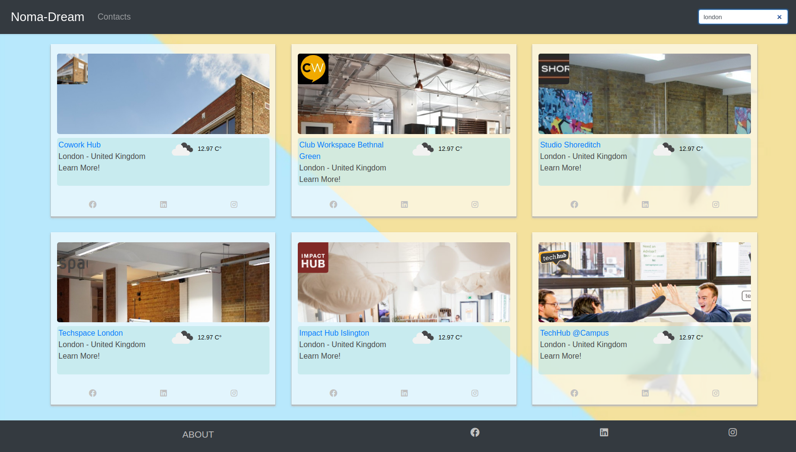

# Sass + bootstrap

An HTML CSS boilerplate with built-in sass support:

- Automatic [Sass](https://sass-lang.com/) transpilation
- Development server powered by [live-server](https://www.npmjs.com/package/live-server) with automatic reload
- Deployments to github pages with [gh-pages](https://www.npmjs.com/package/gh-pages)
- Out of the box [bootstrap](https://getbootstrap.com/docs/5.0/getting-started/introduction/) css support

To learn more about how to add bootstrap javascript features (for modals and image galleries) see the following link: https://getbootstrap.com/docs/5.0/getting-started/introduction/#js

## Get Started

- [Setup](#setup)
- [Useful Commands](#useful-commands)
- [Project Structure](#project-structure)
- [Credits](#credits)

## Setup

1. Clone this repository into a new project folder (replace `[project name]` with your project's name)

   ```
   git clone git@github.com:DigitalCareerInstitute/dci-boilerplate-I.git [project name]
   ```

1. Delete the boilerplate's git history to ensure that the project history only includes your commits

   ```
   cd <project name>
   rm -rf .git
   ```

1. Edit `package.json` to add you project's name

   `package.json`

   ```json
   {
     "name": "[project name]",
     ...
     "author": "[your name]"
   }
   ```

1. Edit `src/index.html` to add your projects name

   ```html
   ...
   <head>
     ...
     <title>[project name]</title>
   </head>
   ...
   ```

1. Start a new git repository and make an initial commit. This will make sure that you can work on your project with git.

   ```
   git init
   git add . && git commit -m "Initial commit"
   ```

1. Install the dependencies

   ```
   npm install
   ```


## Final Result


